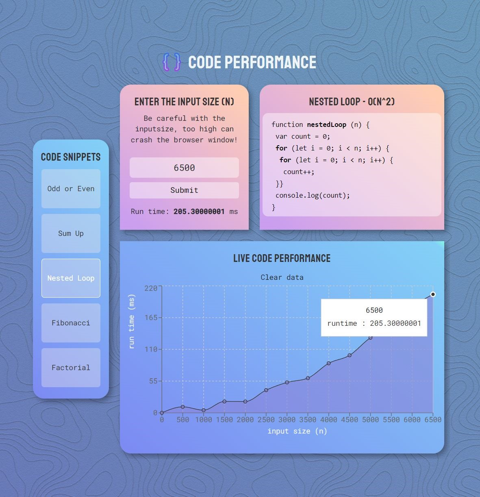

# Code Performance

Run code snippets live in your browser. Give an input size (n) and calculate the runtime (miliseconds), displayed in a graph. To view the app live click [HERE](https://code-performance.web.app/) (hosted on Firebase).

- React frontend framework
- ReCharts library for the graphs

## Reccomended input sizes (n)

For a medium-to-highend pc

1. Odd/Even: `n ≥ 0`
2. Sum Up: `0 ≥ n ≤ 2.500.000.000`
3. Nested Loop: `0 ≥ n ≤ 80.000`
4. Fibonacci: `0 ≥ n ≤ 44`
5. Factorial: `0 ≥ n ≤ 12`

## Screenshot

Application for desktop devices and mobile devices.

    
    

